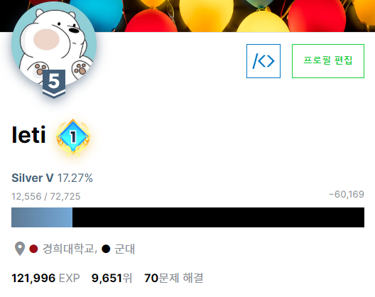

# algorithm
- 푼 알고리즘 문제들 모음.
- solved.ac의 [class](https://solved.ac/class)와 [프로그래머스](https://programmers.co.kr/), [단계별로 풀어보기](https://www.acmicpc.net/step) 3곳의 문제를 풀 예정.

## The reason why I started study algorithm
- 군대에 있을 땐 연등시간을 슬기롭게 보내기 위해.
- 전공이 컴공이고 취업을 위해서 당연히 필요한 공부이니까.
- 매일 조금이라도 공부하는 습관을 들이기 위해.

## rank achieved @ solved.ac
- silver : 2021-01-10 달성.
  - 

## Reference
- [solved.ac](https://solved.ac) : 백준 문제들의 난이도를 알려주는 사이트.
