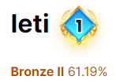

# sjb_algorithm
- 사지방에서 푼 문제들 모음.

- solved.ac의 [class](https://solved.ac/class)순서로 차곡차곡 풀 예정.

## The reason why I started study algorithm

- 군대에 오니 개인정비 시간에 하는게 핸드폰 sns 순회 + 유튜브 죽돌이여서 시간을 버리는 것 같았다.
  = 너무 나태하게 시간 낭비하는게 보기 싫었다.
- 전공이 컴공이고 취업을 위해서 당연히 필요한 공부이니까.
- 매일 조금이라도 공부하는 습관을 들이려고 합니다.

## Class achieved @ solved.ac

- class 1 : 2020-08-11 달성.
  - 
- class 2 : on progress - 8/40 completed.
  - 

## rank achieved @ solved.achieved
- silver : 2021-01-10 달성.
  - 

## Accout info change

- 2020-08-11
  - Ranking : 27443
  - Ranking @ School : 198
  - Correct problems : 54

## Reference

- [solved.ac](https://solved.ac) : 백준 문제들의 난이도를 알려주는 사이트.